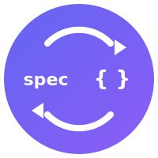

# 🔄 spec-kit-sync

<div align="center">
  
  <br/>
  <strong>Stop lying to your AI agents.</strong>
  <br/><br/>

  [](https://github.com/bgervin/spec-kit-sync/actions/workflows/ci.yml)
  [](https://github.com/github/spec-kit)
  [](https://opensource.org/licenses/MIT)
  [](https://github.com/bgervin/spec-kit-sync/releases/latest)
</div>

<br/>

Your specs say one thing. Your code does another. Every time an AI reads your specs, it generates code that conflicts with reality. This extension fixes that.

## The Problem

You wrote beautiful specs. Then reality happened:

- 🔧 Bug fixes that changed behavior
- 🚀 Features added during "vibe coding"
- 📝 Design docs that superseded specs
- ⏰ Six months of evolution

Now your specs are **documentation fossils**. New developers can't trust them. AI agents generate conflicting code. The "regenerate from spec" promise is broken.

## The Solution

```
/speckit.sync.analyze

📊 Drift Report
━━━━━━━━━━━━━━━━━━━━━━━━━━━━━━━━━━━━━━━━━━━━━━

Specs Analyzed:     12
Requirements:       276
  ✅ Aligned:       193 (70%)
  ⚠️  Drifted:       31 (11%)
  ❓ Unverifiable:   52 (19%)

Unspecced Code:     36 features
Conflicts:           2 (spec vs design doc)

Top Issues:
  • spec-008 says 5 fields, code extracts 4-8 per type
  • spec-011 says one row per doc, code splits receipts
  • ReconcileCommand has no spec coverage

━━━━━━━━━━━━━━━━━━━━━━━━━━━━━━━━━━━━━━━━━━━━━━
```

## Quick Start

```bash
# Install the extension
specify extension add --from https://github.com/bgervin/spec-kit-sync/archive/refs/heads/master.zip

# Analyze your project
/speckit.sync.analyze

# Fix drift
/speckit.sync.propose --interactive
/speckit.sync.apply

# Backfill missing specs
/speckit.sync.backfill <feature-name> --create
```

## Commands

| Command | What it does |
|---------|--------------|
| `speckit.sync.analyze` | Detect drift between specs and code |
| `speckit.sync.propose` | AI suggests fixes (update spec or fix code) |
| `speckit.sync.apply` | Apply approved changes |
| `speckit.sync.conflicts` | Find inter-spec contradictions |
| `speckit.sync.backfill` | Generate spec from unspecced code |

## How It Works

### 1. Analyze

Scans specs and code to find:
- **Drifted requirements**: Spec says X, code does Y
- **Unspecced features**: Code exists, no spec covers it
- **Conflicts**: Two specs (or spec vs design doc) contradict

```
/speckit.sync.analyze --spec 011   # Check one spec
/speckit.sync.analyze --json       # Machine-readable
```

### 2. Propose

AI analyzes each drift and suggests a resolution:

| Strategy | When | Action |
|----------|------|--------|
| **Backfill** | Code is right | Update spec to match code |
| **Align** | Spec is right | Task to fix code |
| **Supersede** | Newer doc wins | Mark old spec superseded |
| **Human** | Can't tell | Surface for review |

```
/speckit.sync.propose --interactive    # Review one-by-one
/speckit.sync.propose --strategy backfill-all
```

### 3. Apply

Execute approved proposals with safety checks:

```
/speckit.sync.apply --dry-run     # Preview changes
/speckit.sync.apply               # Do it
/speckit.sync.apply --auto-commit # Commit after
```

### 4. Backfill

Generate complete specs from existing code:

```
/speckit.sync.backfill reconciliation --create
```

Creates:
- `spec.md` — Requirements extracted from code
- `plan.md` — Architecture documentation
- `quickstart.md` — User guide (if CLI command)
- `tasks.md` — Review checklist

## Ralph Loop Integration

Keep specs synced during autonomous coding:

```yaml
# sync-config.yml
ralph:
  post_iteration_check: true
  on_drift: pause  # backfill | warn | pause
```

The loop pauses when drift is detected, preventing compound errors.

## Real Example

This extension was built to fix [fina](https://github.com/bgervin/fina), a personal finance CLI that drifted during development:

**Before:**
- 12 specs, ~70% coverage
- 3 features with no specs (reconciliation, hints, type-aware extraction)
- spec-008 contradicted by later design doc
- AI agents confused by stale specs

**After:**
```
/speckit.sync.analyze
/speckit.sync.backfill reconciliation --create
/speckit.sync.backfill hints --create
/speckit.sync.backfill type-aware-extraction --create
```

Result: 15 specs, documented architecture, AI agents aligned with reality.

## Installation

```bash
# From URL
specify extension add --from https://github.com/bgervin/spec-kit-sync/archive/refs/heads/master.zip

# Development mode (local clone)
specify extension add --dev /path/to/spec-kit-sync

# From catalog (coming soon)
specify extension add sync
```

## Configuration

```bash
mkdir -p .specify/extensions/sync
cp sync-config.template.yml .specify/extensions/sync/sync-config.yml
```

See [sync-config.template.yml](sync-config.template.yml) for all options.

## Why This Matters

AI coding agents are only as good as their context. When specs lie:

1. Agent reads outdated spec
2. Agent generates code matching spec
3. Code conflicts with existing implementation
4. Human spends time fixing AI's "correct" code
5. Trust in AI assistance erodes

**spec-kit-sync keeps specs honest**, so AI agents generate code that actually works.

---

Built for [spec-kit](https://github.com/bgervin/spec-kit) | MIT License
