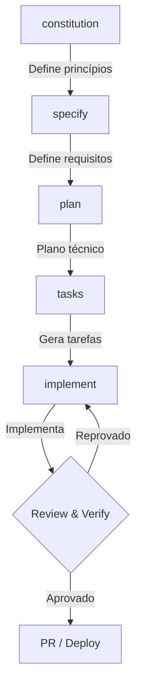
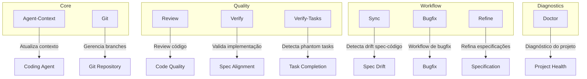
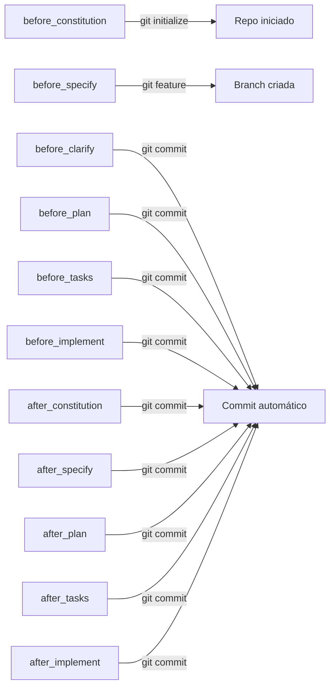
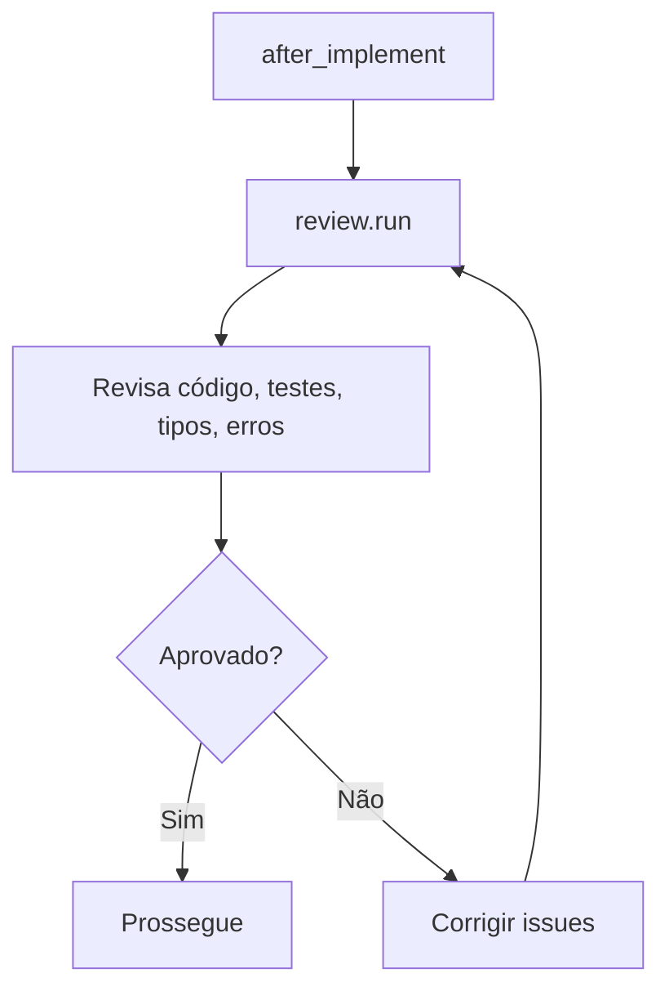
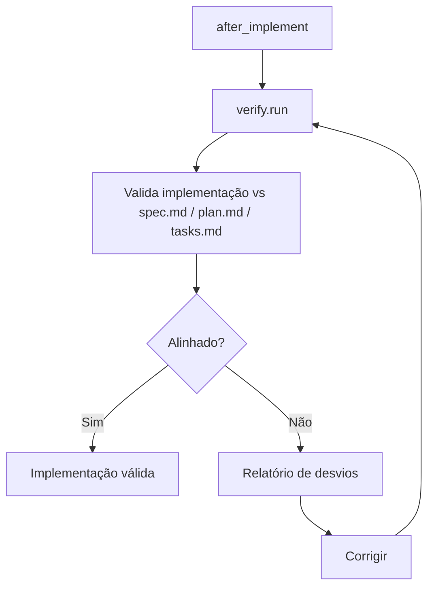
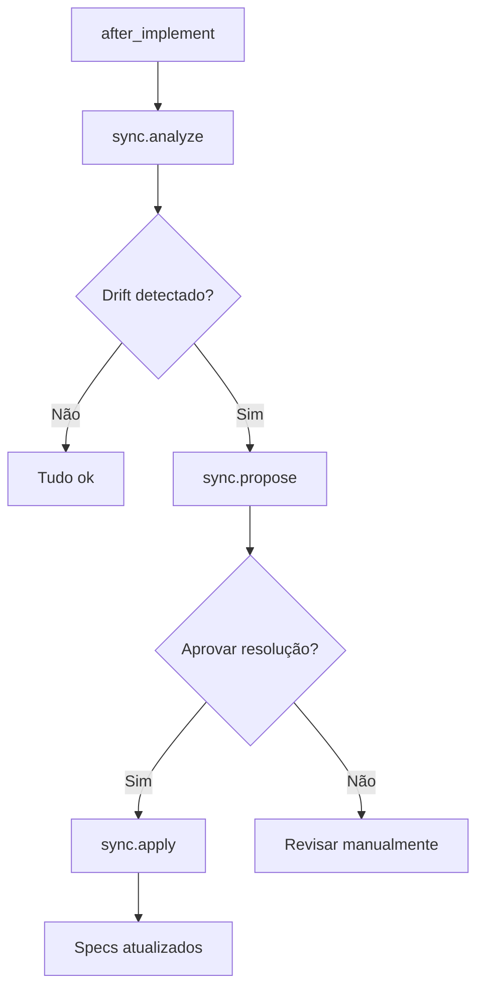
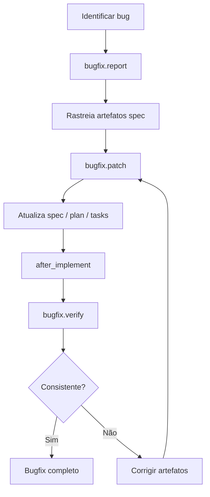
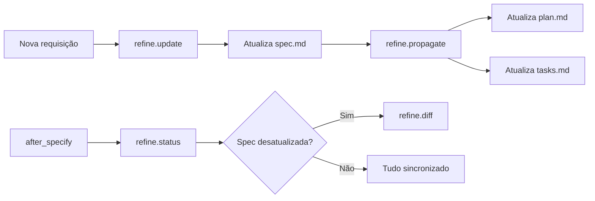

# Spec Kit Docker Template

[](https://github.com/github/spec-kit)
[](LICENSE)
[](https://github.com/opencode-ai/opencode)

> Template Docker para [Spec Kit](https://github.com/github/spec-kit) — desenvolvimento orientado por especificações (SDD) com tudo configurado e pronto para usar.

## Índice

- [Sobre](#sobre)
- [Pré-requisitos](#pré-requisitos)
- [Início Rápido](#início-rápido)
- [Fluxo de Trabalho](#fluxo-de-trabalho)
- [Comandos](#comandos)
- [Como Usar como Template](#como-usar-como-template)
- [Licença](#licença)

## Sobre

Este repositório é um template Docker com [Spec Kit](https://github.com/github/spec-kit) e todas as extensões oficiais configuradas. Use como base para projetos que seguem Spec-Driven Development com AI Coding Agents (OpenCode, Copilot, etc.).

### Tecnologias

- **Docker** — ambiente isolado e reproduzível
- **Spec Kit 0.12.5** — core do SDD
- **OpenCode** — integração com AI coding agent
- **8 extensões** — Git, Review, Verify, Sync, Bugfix, Refine, Doctor, Agent-Context

## Pré-requisitos

- Docker e Docker Compose instalados
- Git
- AI Coding Agent (opencode, copilot, etc.)

## Início Rápido

```bash
# 1. Build da imagem
docker compose -f docker-compose.specify.yml build

# 2. Inicializar projeto
./specify init . --integration opencode

# 3. Iniciar fluxo SDD
./specify constitution
./specify specify "Descrição da feature"
```

## Fluxo de Trabalho

### Ciclo Principal SDD



### Fluxo com Hooks (before → comando → after)

Cada comando core é envolvido por hooks que executam antes e depois automaticamente:

```mermaid
graph LR
    A[before_constitution] --> B[constitution]
    B --> C[after_constitution]
    C --> D[before_specify]
    D --> E[specify]
    E --> F[after_specify]
    F --> G[before_plan]
    G --> H[plan]
    H --> I[after_plan]
    I --> J[before_tasks]
    J --> K[tasks]
    K --> L[after_tasks]
    L --> M[before_implement]
    M --> N[implement]
    N --> O[after_implement]
```



Os hooks `before_*` preparam o ambiente (git branches, contexto). Os hooks `after_*` executam verificações (review, verify, sync, commit, etc.).

### Extensões Instaladas



### Extensão Git — Branch Management & Auto-Commit



### Extensão Review — Code Review Automático

Disparado em `after_implement`:



### Extensão Verify — Validação vs Specs

Disparado em `after_implement`:



### Extensão Sync — Detecção de Drift

Disparado em `after_implement`:



### Extensão Bugfix — Workflow de Correção



### Extensão Refine — Refinamento de Especificações



## Comandos

### Comandos Core — Ciclo SDD

| Comando | Descrição | Quando usar |
|---------|-----------|-------------|
| `./specify constitution` | Define princípios e constraints do projeto | Antes de qualquer especificação |
| `./specify specify "..."` | Define requisitos de uma feature | Após constitution, antes de plan |
| `./specify plan` | Cria plano técnico detalhado | Após specify, antes de tasks |
| `./specify tasks` | Gera breakdown de tarefas | Após plan, antes de implement |
| `./specify implement` | Executa implementação orientada por specs | Após tasks |
| `./specify clarify` | Esclarece requisitos ambíguos | Durante specify ou implement |
| `./specify analyze` | Analisa o projeto e sugere direções | A qualquer momento |
| `./specify checklist` | Gera checklist de verificação | Antes de PR/deploy |
| `./specify converge` | Converge artefatos spec desatualizados | Quando houver drift |
| `./specify taskstoissues` | Converte tasks em issues do GitHub | Após tasks, para acompanhamento |

### Comandos das Extensões

| Extensão | Comando | Descrição | Disparo automático |
|----------|---------|-----------|--------------------|
| **Git** | `speckit.git.initialize` | Inicializa repositório git | `before_constitution` |
| | `speckit.git.feature` | Cria branch para feature | `before_specify` |
| | `speckit.git.commit` | Auto-commit do progresso | `before_*` e `after_*` |
| | `speckit.git.validate` | Valida estado da branch | Manual |
| | `speckit.git.remote` | Detecta remote configurado | Manual |
| **Agent-Context** | `speckit.agent-context.update` | Atualiza contexto do agente | `after_*` |
| **Review** | `speckit.review.run` | Review completo (código, testes, tipos, erros, simplificação) | `after_implement` |
| | `speckit.review.code` | Apenas code quality | Manual |
| | `speckit.review.comments` | Análise de comentários | Manual |
| | `speckit.review.tests` | Cobertura de testes | Manual |
| | `speckit.review.errors` | Error handling | Manual |
| | `speckit.review.types` | Type design | Manual |
| | `speckit.review.simplify` | Simplificação de código | Manual |
| **Verify** | `speckit.verify.run` | Valida implementação vs spec/plan/tasks | `after_implement` |
| **Verify-Tasks** | `speckit.verify-tasks.run` | Detecta phantom tasks (tasks implementadas sem especificação) | `after_implement` |
| **Sync** | `speckit.sync.analyze` | Detecta drift entre spec e código | `after_implement` |
| | `speckit.sync.propose` | Propõe resoluções para drift | Manual |
| | `speckit.sync.apply` | Aplica resoluções aprovadas | Manual |
| | `speckit.sync.conflicts` | Detecta conflitos entre artefatos | Manual |
| | `speckit.sync.backfill` | Gera spec a partir de código existente | Manual |
| **Bugfix** | `speckit.bugfix.report` | Reporta bug e rastreia artefatos | Após identificar bug |
| | `speckit.bugfix.patch` | Aplica patch e atualiza specs | Manual |
| | `speckit.bugfix.verify` | Verifica consistência pós-patch | `after_implement` |
| **Refine** | `speckit.refine.update` | Atualiza spec.md com nova requisição | Após nova solicitação |
| | `speckit.refine.propagate` | Propaga mudanças para plan/tasks | Manual |
| | `speckit.refine.diff` | Mostra diferenças entre artefatos | Manual |
| | `speckit.refine.status` | Verifica se specs estão sincronizadas | `after_specify`, `after_plan` |
| **Doctor** | `speckit.doctor.check` | Diagnóstico completo do projeto | Manual |

## Como Usar como Template

```bash
# 1. Clone
git clone https://github.com/wagner-sousa/spec-kit-docker.git meu-projeto
cd meu-projeto

# 2. Renomeie (README, .specify/memory/constitution.md)

# 3. Inicialize o Spec Kit
./specify init . --integration opencode

# 4. Comece o fluxo SDD
./specify constitution
./specify specify "Minha primeira feature"
```

## Licença

MIT. Veja [LICENSE](LICENSE).
