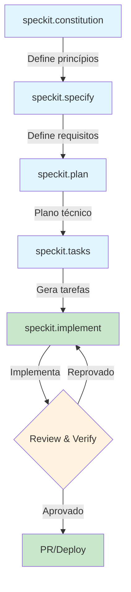
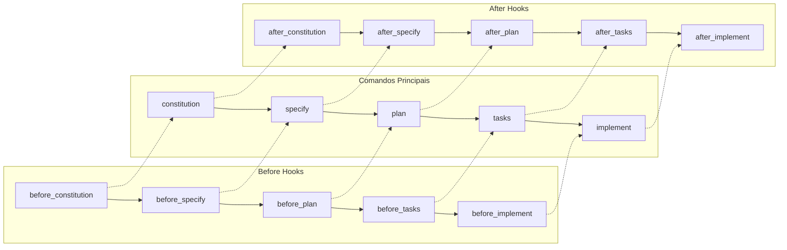
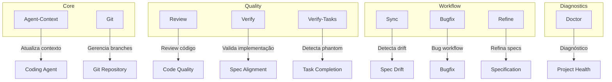
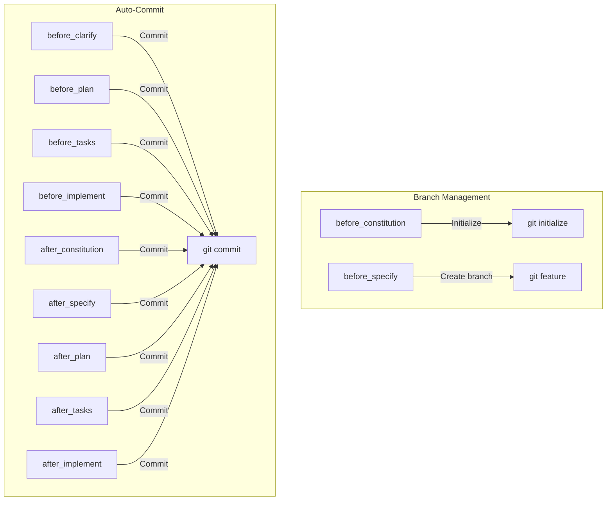
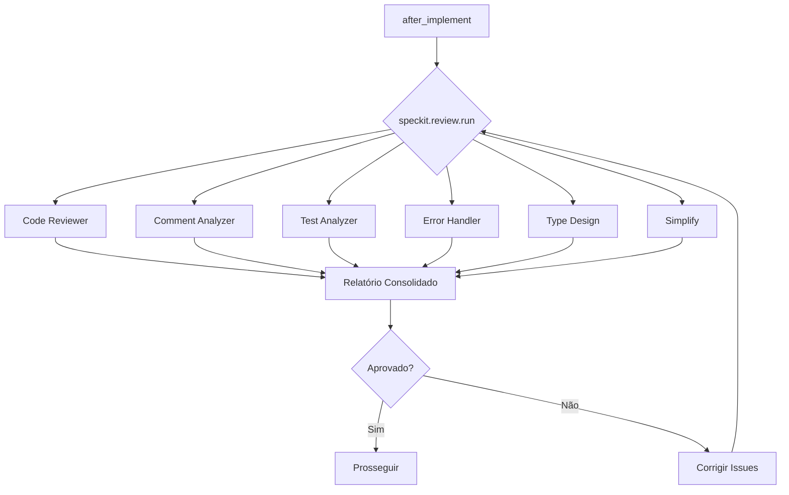
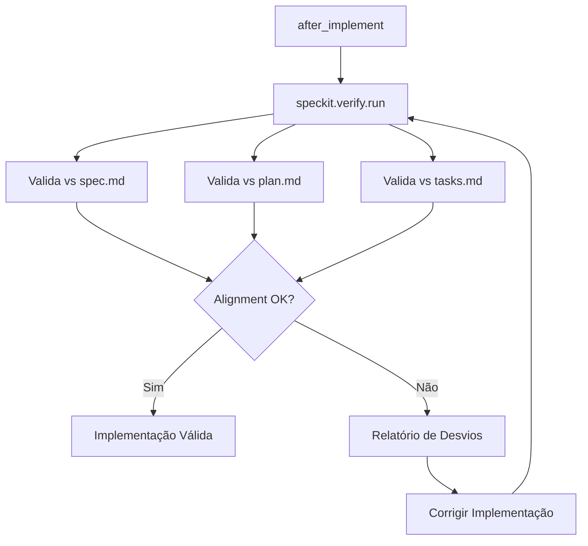
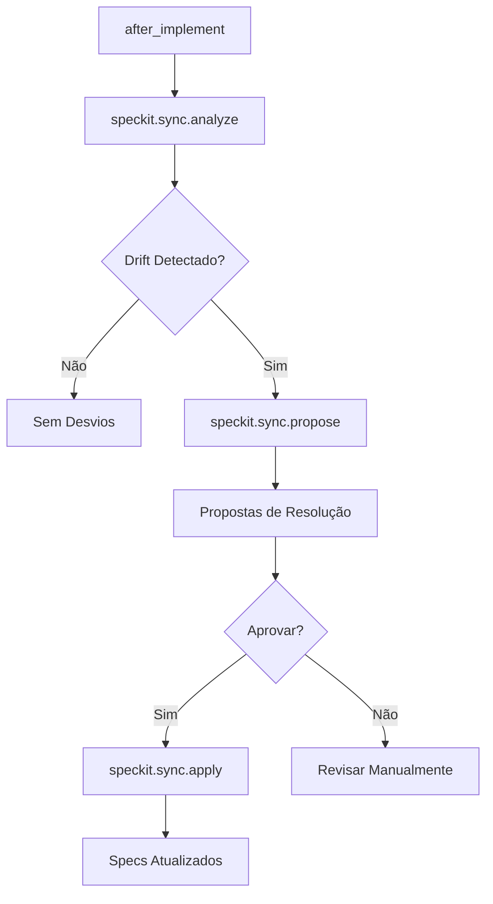
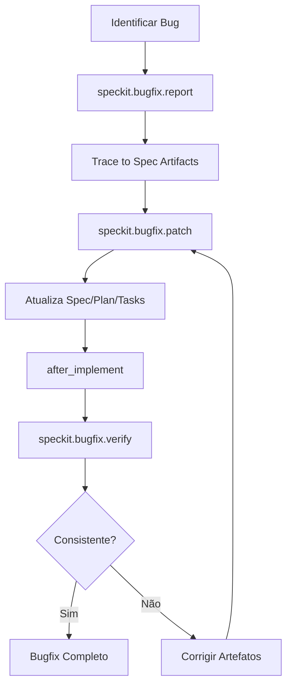
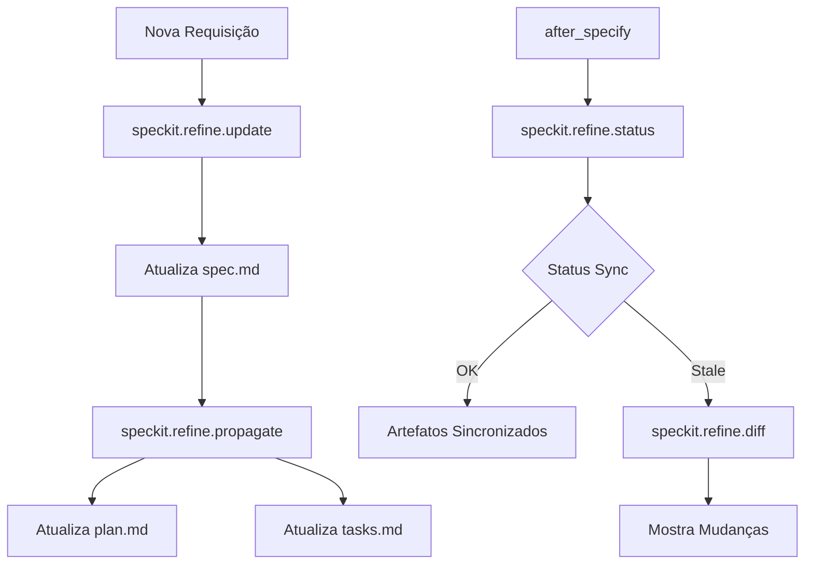
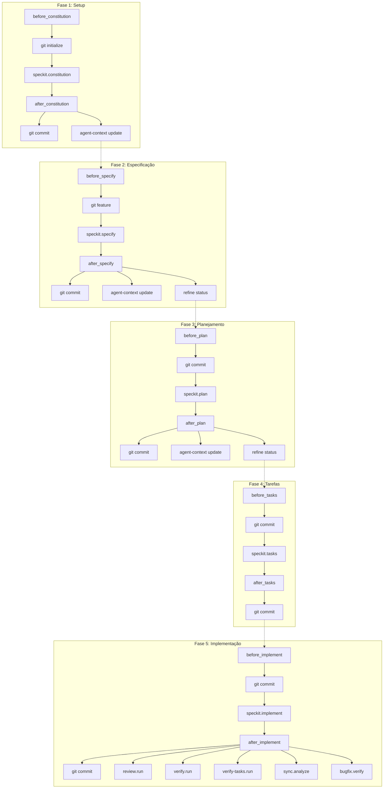

# Spec Kit Docker Template

[](https://github.com/github/spec-kit)
[](LICENSE)
[](https://github.com/opencode-ai/opencode)

Template Docker para [GitHub Spec Kit](https://github.com/github/spec-kit) - Ferramenta de desenvolvimento orientado por especificações (Spec-Driven Development).

## Visão Geral

Este repositório é um template completo para projetos que utilizam Spec Kit com Docker. Inclui todas as extensões configuradas e prontas para uso, servindo como base para futuros projetos.

### Pré-requisitos

- Docker e Docker Compose instalados
- Git
- AI Coding Agent (opencode, copilot, etc.)

## Início Rápido

### 1. Build da Imagem

```bash
docker compose -f docker-compose.specify.yml build
```

### 2. Inicializar Projeto

```bash
./specify init . --integration opencode
```

### 3. Iniciar Fluxo SDD

```bash
./specify constitution
./specify specify "Descrição da feature"
```

## Fluxo de Trabalho Spec Kit

### Ciclo Principal SDD



### Fluxo com Hooks



## Extensões Instaladas

### Visão Geral das Extensões



### Fluxo da Extensão Git



### Fluxo da Extensão Review



### Fluxo da Extensão Verify



### Fluxo da Extensão Sync



### Fluxo da Extensão Bugfix



### Fluxo da Extensão Refine



### Fluxo Completo com Todas as Extensões



## Comandos Disponíveis

### Comandos Principais Spec Kit

| Comando | Descrição | Extensão |
|---------|-----------|----------|
| `/speckit.constitution` | Cria princípios do projeto | Core |
| `/speckit.specify` | Define o que construir | Core |
| `/speckit.plan` | Cria plano técnico | Core |
| `/speckit.tasks` | Gera breakdown de tarefas | Core |
| `/speckit.implement` | Executa implementação | Core |
| `/speckit.clarify` | Esclarece requisitos | Core |
| `/speckit.analyze` | Analisa projeto | Core |
| `/speckit.checklist` | Gera checklist | Core |
| `/speckit.converge` | Converge artefatos | Core |
| `/speckit.taskstoissues` | Converte tasks para issues | Core |

### Comandos das Extensões

| Extensão | Comando | Descrição |
|----------|---------|-----------|
| **Git** | `speckit.git.feature` | Cria branch feature |
| | `speckit.git.validate` | Valida branch |
| | `speckit.git.remote` | Detecta remote |
| | `speckit.git.initialize` | Inicializa repo |
| | `speckit.git.commit` | Auto-commit |
| **Agent-Context** | `speckit.agent-context.update` | Atualiza contexto |
| **Review** | `speckit.review.run` | Review completo |
| | `speckit.review.code` | Code quality |
| | `speckit.review.comments` | Análise comentários |
| | `speckit.review.tests` | Cobertura testes |
| | `speckit.review.errors` | Error handling |
| | `speckit.review.types` | Type design |
| | `speckit.review.simplify` | Simplificação |
| **Verify** | `speckit.verify.run` | Valida implementação |
| **Verify-Tasks** | `speckit.verify-tasks.run` | Detecta phantom |
| **Sync** | `speckit.sync.analyze` | Analisa drift |
| | `speckit.sync.propose` | Propõe resoluções |
| | `speckit.sync.apply` | Aplica resoluções |
| | `speckit.sync.conflicts` | Detecta conflitos |
| | `speckit.sync.backfill` | Gera spec de código |
| **Bugfix** | `speckit.bugfix.report` | Reporta bug |
| | `speckit.bugfix.patch` | Aplica patch |
| | `speckit.bugfix.verify` | Verifica patch |
| **Refine** | `speckit.refine.update` | Atualiza spec |
| | `speckit.refine.propagate` | Propaga mudanças |
| | `speckit.refine.diff` | Mostra diferenças |
| | `speckit.refine.status` | Status sync |
| **Doctor** | `speckit.doctor.check` | Diagnóstico |

## Estrutura do Projeto

```
spec-kit-docker/
├── .specify/                    # Configuração Spec Kit
│   ├── extensions/              # Extensões instaladas
│   │   ├── agent-context/       # Gerenciamento contexto
│   │   ├── bugfix/              # Workflow bugfix
│   │   ├── doctor/              # Diagnóstico
│   │   ├── git/                 # Git workflow
│   │   ├── refine/              # Refinamento specs
│   │   ├── review/              # Code review
│   │   ├── sync/                # Sync specs/código
│   │   ├── verify/              # Validação implementação
│   │   └── verify-tasks/        # Detecção phantom
│   ├── integrations/            # Integrações (opencode, etc.)
│   ├── memory/                  # Constituição
│   ├── scripts/                 # Scripts auxiliares
│   ├── templates/               # Templates de artefatos
│   ├── workflows/               # Workflows SDD
│   ├── extensions.yml           # Config extensões
│   ├── integration.json         # Config integração
│   └── init-options.json        # Opções inicialização
├── .opencode/                   # Configuração OpenCode
│   └── commands/                # 41 comandos speckit.*
├── docker-compose.specify.yml   # Docker Compose
├── Dockerfile                   # Imagem Docker
├── post-create.sh               # Script setup
├── specify                      # Script wrapper
└── README.md                    # Este arquivo
```

## Configuração

### Auto-Commit (Git Extension)

Edite `.specify/extensions/git/git-config.yml`:

```yaml
auto_commit:
  default: true  # Habilita para todos os comandos
  before_implement:
    enabled: true
    message: "[Spec Kit] Save progress before implementation"
  after_implement:
    enabled: true
    message: "[Spec Kit] Implementation progress"
```

### Agentes de Review

Edite `.specify/extensions/review/review-config.yml`:

```yaml
agents:
  code: true
  comments: true
  tests: true
  errors: true
  types: true
  simplify: true
```

### Drift Detection (Sync Extension)

Edite `.specify/extensions/sync/sync-config.yml`:

```yaml
analysis:
  include_design_docs: true
  ignore_patterns:
    - "**/node_modules/**"
proposals:
  default_strategy: ask
  min_confidence: 0.7
```

## Como Usar como Template

1. **Clone este repositório**
   ```bash
   git clone https://github.com/wagner-sousa/spec-kit-docker.git meu-projeto
   cd meu-projeto
   ```

2. **Renomeie o projeto**
   ```bash
   # Edite README.md com o nome do seu projeto
   # Edite .specify/memory/constitution.md com sua constituição
   ```

3. **Inicialize o Spec Kit**
   ```bash
   ./specify init . --integration opencode
   ```

4. **Comece o fluxo SDD**
   ```bash
   ./specify constitution
   ./specify specify "Minha feature"
   ```

## Referências

- [Spec Kit Documentation](https://github.com/github/spec-kit)
- [Spec Kit Extensions](https://github.com/github/spec-kit#extensions)
- [OpenCode Integration](https://github.com/opencode-ai/opencode)

## Licença

MIT
