# Spec Kit Docker Template

[](https://github.com/github/spec-kit)
[](LICENSE)
[](https://github.com/opencode-ai/opencode)
[](https://docker.com)
[](https://python.org)
[](https://github.com/wagner-sousa/spec-kit-docker)

> Template Docker para [Spec Kit](https://github.com/github/spec-kit) — desenvolvimento orientado por especificações (SDD) com tudo configurado e pronto para usar.

## 🎯 Sobre

Este repositório é um template Docker com [Spec Kit](https://github.com/github/spec-kit) e todas as extensões oficiais configuradas. Use como base para projetos que seguem Spec-Driven Development com AI Coding Agents (OpenCode, Copilot, etc.).

## 🛠 Tecnologias

- **Docker** — ambiente isolado e reproduzível
- **Spec Kit 0.12.5** — core do SDD
- **OpenCode** — integração com AI coding agent
- **11 extensões** — Git, Review, Verify, Verify-Tasks, Sync, Bugfix, Refine, Doctor, Agent-Context, Lifecycle, Switch

## 📦 Pré-requisitos

- Docker e Docker Compose instalados
- Git
- AI Coding Agent (opencode, copilot, etc.)

## 🚀 Instalação

### Clone o Repositório

```bash
git clone https://github.com/wagner-sousa/spec-kit-docker.git meu-projeto
cd meu-projeto
```

### Personalize

Renomeie o README e o arquivo `.specify/memory/constitution.md` para seu projeto.

### Build da Imagem

```bash
docker compose -f docker-compose.specify.yml build
```

### Inicialize o Spec Kit

```bash
./specify init . --integration opencode
```

### Inicie o Fluxo SDD

```bash
./specify constitution
./specify specify "Descrição da feature"
```

## 🔐 Variáveis de Ambiente

| Variável | Descrição |
|----------|-----------|
| `SPECIFY_INIT_DIR` | Diretório do projeto contendo `.specify/` (útil para monorepos) |
| `SPECIFY_FEATURE_DIRECTORY` | Sobrescreve a feature ativa (prioridade sobre `feature.json`) |
| `SPECIFY_FEATURE` | Nome da feature para repositórios sem Git |

## 📁 Estrutura do Projeto

```
spec-kit-docker/
├── .specify/              # Core do Spec Kit
│   ├── extensions/        # Extensões instaladas (11)
│   ├── memory/            # Constitution e contexto
│   └── scripts/           # Scripts de automação
├── specs/                 # Especificações das features
│   └── NNN-feature-name/
│       ├── spec.md
│       ├── plan.md
│       └── tasks.md
├── .opencode/             # Configuração do OpenCode
│   └── commands/          # Comandos das extensões
├── docker-compose.specify.yml
├── specify                # Entrypoint CLI
└── README.md
```

## 🏗️ Arquitetura e Fluxo de Trabalho

### Ciclo Principal SDD

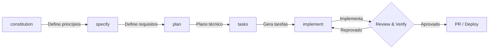

### Fluxo com Hooks (before → comando → after)

Cada comando core é envolvido por hooks que executam antes e depois automaticamente:

```mermaid
graph LR
    subgraph "Foundation"
        A[before_constitution] --> B[constitution] --> C[after_constitution]
    end
    subgraph "Specification"
        D[before_specify] --> E[specify] --> F[after_specify]
    end
    subgraph "Planning"
        G[before_plan] --> H[plan] --> I[after_plan]
    end
    subgraph "Execution"
        J[before_tasks] --> K[tasks] --> L[after_tasks]
        M[before_implement] --> N[implement] --> O[after_implement]
    end
    C --> D
    F --> G
    I --> J
    L --> M
```

Os hooks `before_*` preparam o ambiente (git branches, contexto). Os hooks `after_*` executam verificações (review, verify, sync, commit, etc.).

### Extensões Instaladas

**Grupo A — Core + Quality:**

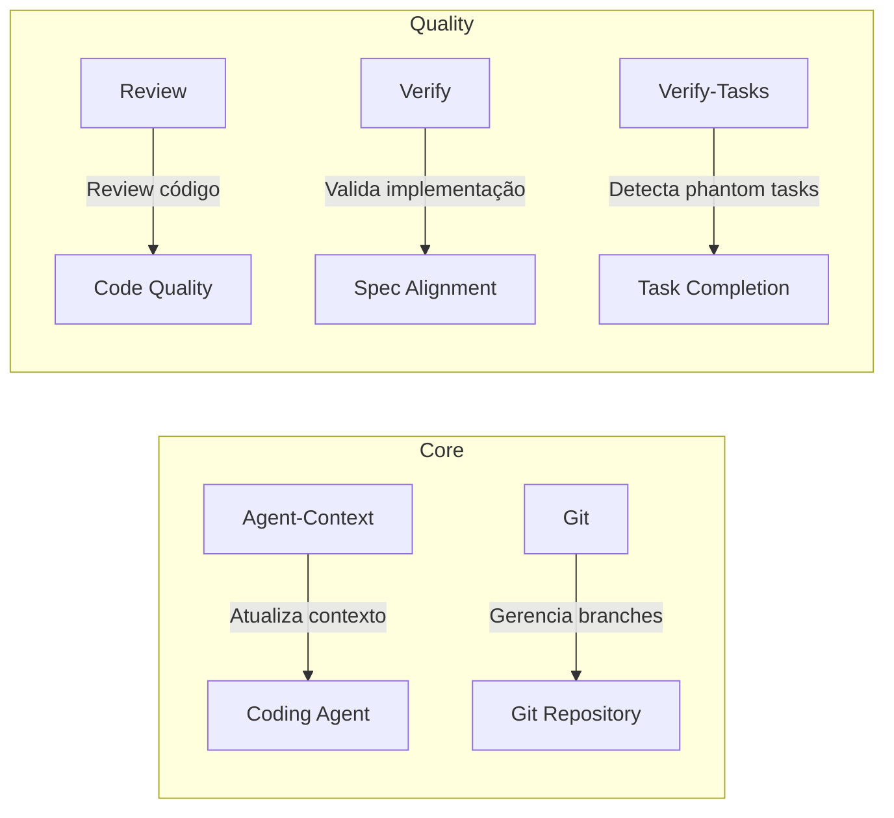

**Grupo B — Workflow + Governance + Diagnostics:**

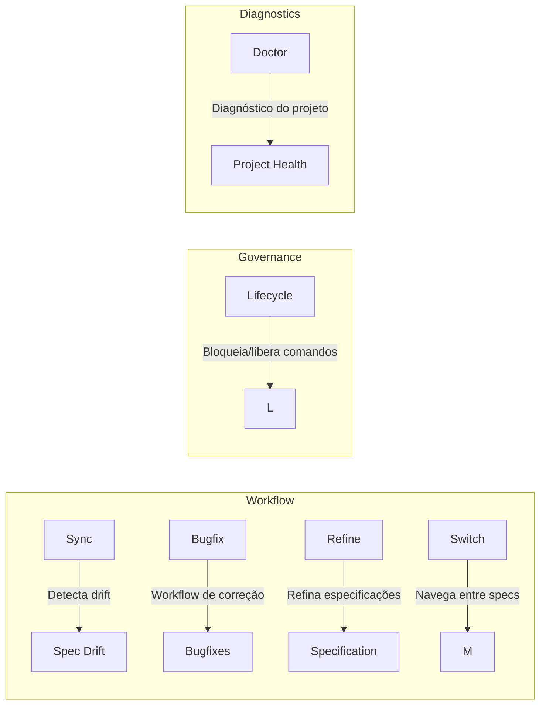

📖 [README Agent-Context](.specify/extensions/agent-context/README.md) · [README Doctor](.specify/extensions/doctor/README.md) · [README Verify-Tasks](.specify/extensions/verify-tasks/README.md)

### Extensão Git — Branch Management & Auto-Commit

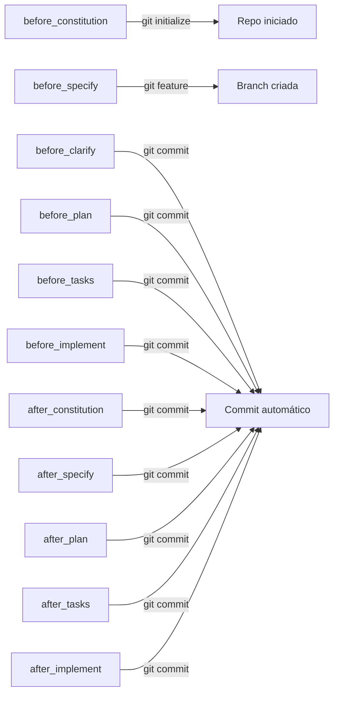

📖 [README da extensão](.specify/extensions/git/README.md)

### Extensão Review — Code Review Automático

Disparado em `after_implement`:

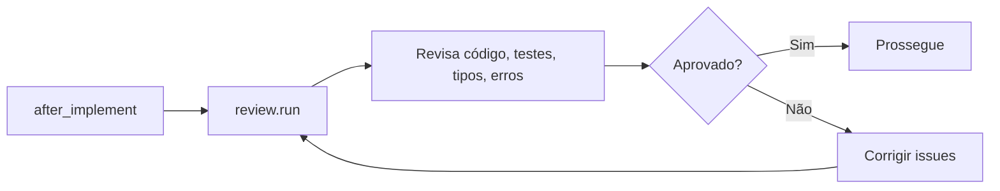

📖 [README da extensão](.specify/extensions/review/README.md)

### Extensão Verify — Validação vs Specs

Disparado em `after_implement`:

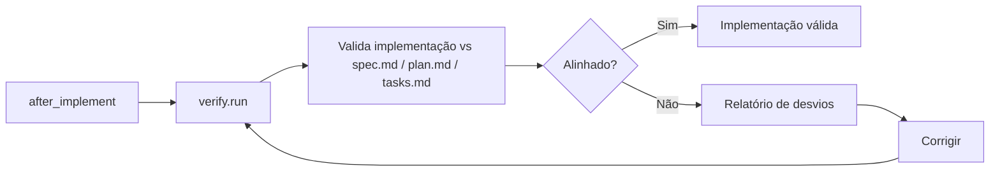

📖 [README da extensão](.specify/extensions/verify/README.md)

### Extensão Sync — Detecção de Drift

Disparado em `after_implement`:

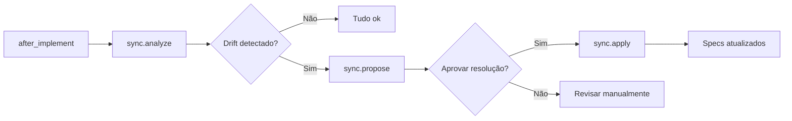

📖 [README da extensão](.specify/extensions/sync/README.md)

### Extensão Bugfix — Workflow de Correção

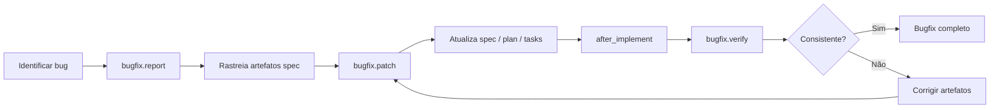

📖 [README da extensão](.specify/extensions/bugfix/README.md)

### Extensão Refine — Refinamento de Especificações

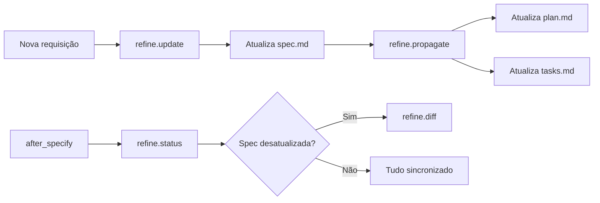

📖 [README da extensão](.specify/extensions/refine/README.md)

### Extensão Lifecycle — Gerenciamento de Fases

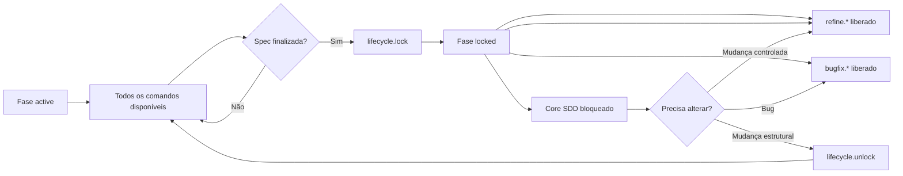

Controla o ciclo de vida da especificação. Quando ativa (`locked`), bloqueia comandos de escrita direta (`specify`, `clarify`, `plan`, `tasks`, `checklist`, `analyze`) e permite apenas caminhos controlados (`refine.*`, `bugfix.*`).

📖 [README da extensão](.specify/extensions/lifecycle/README.md)

### Extensão Switch — Navegação entre Specs

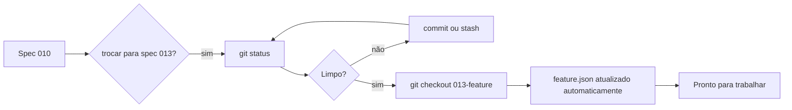

Navega entre especificações sem conflitos de `feature.json`. O `switch.set` faz `git checkout` primeiro — a branch alvo já contém o `feature.json` correto.

📖 [README da extensão](.specify/extensions/switch/README.md)

### Comandos

#### Comandos Core — Ciclo SDD

| Comando | Descrição | Quando usar |
|---------|-----------|-------------|
| `./specify constitution` | Define princípios e constraints do projeto | Antes de qualquer especificação |
| `./specify specify "..."` | Define requisitos de uma feature | Após constitution, antes de plan |
| `./specify plan` | Cria plano técnico detalhado | Após specify, antes de tasks |
| `./specify tasks` | Gera breakdown de tarefas | Após plan, antes de implement |
| `./specify implement` | Executa implementação orientada por specs | Após tasks |
| `./specify clarify` | Esclarece requisitos ambíguos | Durante specify ou implement |
| `./specify analyze` | Analisa o projeto e sugere direções | A qualquer momento |
| `./specify checklist` | Gera checklist de verificação | Antes de PR/deploy |
| `./specify converge` | Converge artefatos spec desatualizados | Quando houver drift |
| `./specify taskstoissues` | Converte tasks em issues do GitHub | Após tasks, para acompanhamento |

#### Comandos das Extensões

| Extensão | Comando | Descrição | Disparo automático |
|----------|---------|-----------|--------------------|
| **Git** | `speckit.git.initialize` | Inicializa repositório git | `before_constitution` |
| | `speckit.git.feature` | Cria branch para feature | `before_specify` |
| | `speckit.git.commit` | Auto-commit do progresso | `before_*` e `after_*` |
| | `speckit.git.validate` | Valida estado da branch | Manual |
| | `speckit.git.remote` | Detecta remote configurado | Manual |
| **Agent-Context** | `speckit.agent-context.update` | Atualiza contexto do agente | `after_*` |
| **Review** | `speckit.review.run` | Review completo (código, testes, tipos, erros, simplificação) | `after_implement` |
| | `speckit.review.code` | Apenas code quality | Manual |
| | `speckit.review.comments` | Análise de comentários | Manual |
| | `speckit.review.tests` | Cobertura de testes | Manual |
| | `speckit.review.errors` | Error handling | Manual |
| | `speckit.review.types` | Type design | Manual |
| | `speckit.review.simplify` | Simplificação de código | Manual |
| **Verify** | `speckit.verify.run` | Valida implementação vs spec/plan/tasks | `after_implement` |
| **Verify-Tasks** | `speckit.verify-tasks.run` | Detecta phantom tasks (tasks implementadas sem especificação) | `after_implement` |
| **Sync** | `speckit.sync.analyze` | Detecta drift entre spec e código | `after_implement` |
| | `speckit.sync.propose` | Propõe resoluções para drift | Manual |
| | `speckit.sync.apply` | Aplica resoluções aprovadas | Manual |
| | `speckit.sync.conflicts` | Detecta conflitos entre artefatos | Manual |
| | `speckit.sync.backfill` | Gera spec a partir de código existente | Manual |
| **Bugfix** | `speckit.bugfix.report` | Reporta bug e rastreia artefatos | Após identificar bug |
| | `speckit.bugfix.patch` | Aplica patch e atualiza specs | Manual |
| | `speckit.bugfix.verify` | Verifica consistência pós-patch | `after_implement` |
| **Refine** | `speckit.refine.update` | Atualiza spec.md com nova requisição | Após nova solicitação |
| | `speckit.refine.propagate` | Propaga mudanças para plan/tasks | Manual |
| | `speckit.refine.diff` | Mostra diferenças entre artefatos | Manual |
| | `speckit.refine.status` | Verifica se specs estão sincronizadas | `after_specify`, `after_plan` |
| **Doctor** | `speckit.doctor.check` | Diagnóstico completo do projeto | Manual |
| **Lifecycle** | `speckit.lifecycle.lock` | Bloqueia comandos de escrita após spec finalizada | Manual |
| | `speckit.lifecycle.unlock` | Reabilita todos os comandos | Manual |
| | `speckit.lifecycle.status` | Mostra fase atual e disponibilidade de comandos | Manual |
| **Switch** | `speckit.switch.list` | Lista todas as specs disponíveis | Manual |
| | `speckit.switch.set NNN` | Troca para outra spec (git checkout + feature.json automático) | Manual |

## 🧪 Testes

- **`specify doctor`** — diagnóstico do projeto via CLI
- **`speckit.doctor.check`** — diagnóstico completo (extensões, hooks, sincronia)
- **`speckit.verify.run`** — valida implementação vs spec/plan/tasks
- **`speckit.verify-tasks.run`** — detecta phantom tasks

_Nota: `doctor.check` e `verify.run` são disparados automaticamente em hooks `after_*`._

## 📄 Licença

MIT. Veja [LICENSE](LICENSE).

## 📬 Contato

**Wagner Sousa** — [GitHub](https://github.com/wagner-sousa)
